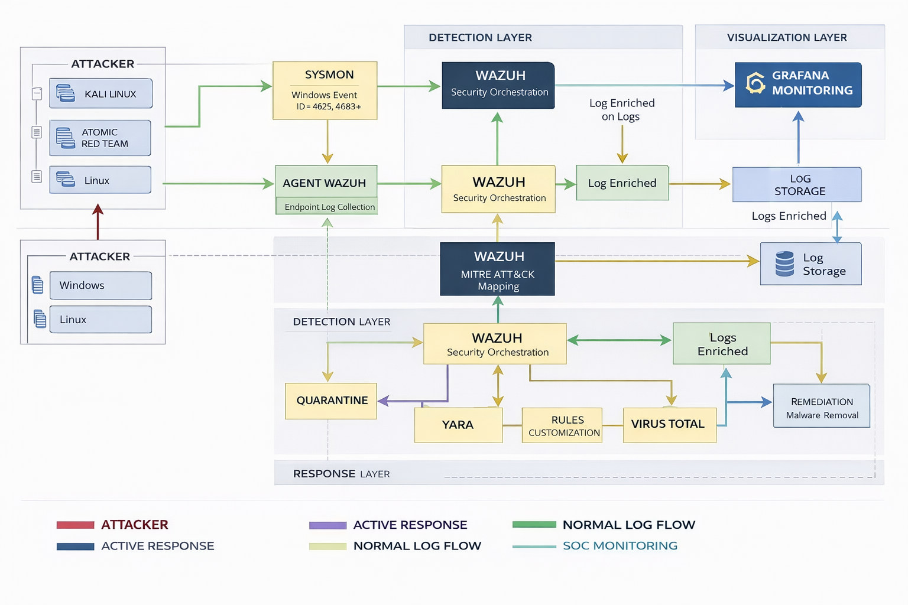

# Blue Team SOC Lab
> Detection Engineering | Incident Response | Threat Simulation

This project documents a personal Security Operations Center (SOC) laboratory built to simulate real-world cybersecurity monitoring and incident response.

The lab integrates multiple security and monitoring tools to detect, analyze and respond to potential threats.

## Technologies Used

- 🟠 Proxmox VE (Virtualization Platform)
- 🔵 Wazuh SIEM
- ⚪ Sysmon (Windows Telemetry)
- ⚪ Auditd (Linux Telemetry)
- 🟠 Grafana (Visualization and Dashboards)
- 🔴 Atomic Red Team (Attack Simulation)
- 🔵 Kali Linux (Attacker Simulation)

## Architecture

The lab is structured in multiple layers:

- Data Collection Layer
- Detection Layer
- Response Layer
- Visualization Layer

Architecture diagram:

## Detection Capabilities

Examples implemented in this lab:

- Brute Force Attack Detection
- Privilege Escalation Detection
- Suspicious Process Execution Detection

Each scenario includes:

- Attack simulation
- Log analysis
- Detection logic
- Incident triage process

## Incident Response

The lab also simulates automated and manual response actions using:

- Wazuh Active Response
- YARA analysis
- VirusTotal enrichment
- Quarantine procedures

## Purpose

This lab was created to practice:

- Threat Detection
- Incident Analysis
- Security Monitoring
- Blue Team Operations
